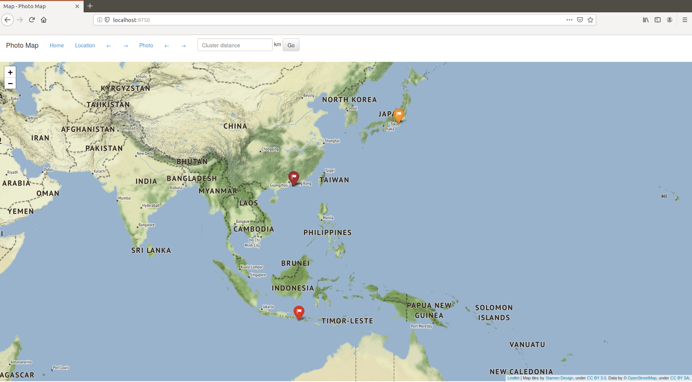
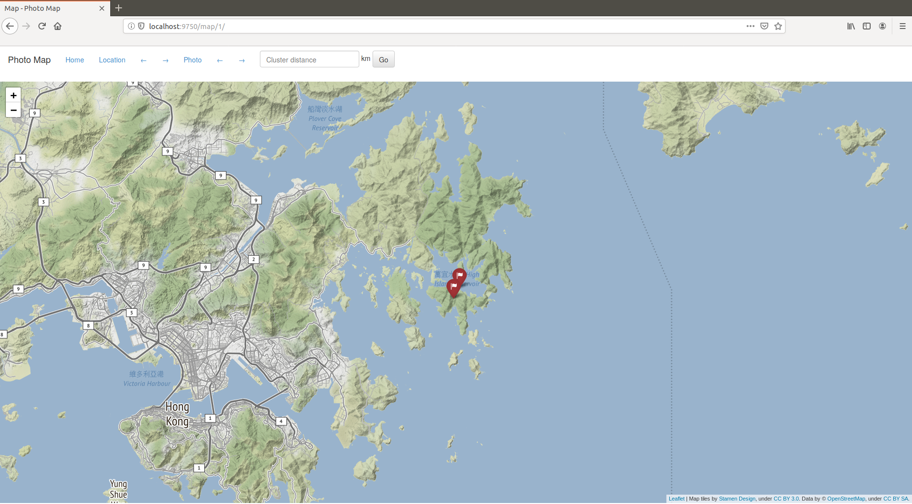
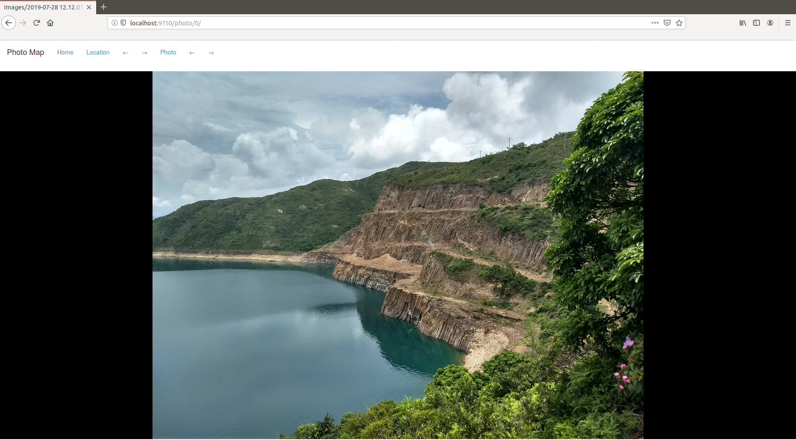

## Photo Map

The aim of this project is a pure Python web application for viewing pictures, grouped by location, on an interactive map.

So, if you want to put a bit of oomph into your photo viewing experience and have some experience with Python, this project might interest you :)

Topics covered are processing (image) metadata, training a clustering model and building a flask app.

---

Let's start with some of the lessons learned

- Some cameras save the rotation of pictures as a parameter. Web browsers usually don't  read exif tags (picture metadata), whereas normal image viewers do. There's a quick fix that works only for Firefox. I used it, not wanting to focus on the intricacies of website programming. More information can be found here [https://blog.praveen.science/crazy-image-exif-orientation-bug-or-feature/#browserimplementations](https://blog.praveen.science/crazy-image-exif-orientation-bug-or-feature/#browserimplementations) [accessed 8. September 2019]
- GPS coordinates are stored in a somewhat awkward format -> parsing is necessary
- Distance metric for coordinates (longitude/latitude) -> Great circle distance calculation (and remembering to change from degrees to radians)
- A web application serves content from a static folder, that needs to be a subfolder of the application folder (at least this is the easiest way). For a locally running web app you don't want to copy x GB of images. The workaround is creating symbolic links to the images in the static folder.

---

### Introduction
The folder structure is


```
photo_map
│   README.md
│   flask_app.py
│   pager.py
│   photo_tools.py
│   requirements.txt
│   test.py
│
└───static
│   │
│   └───images
│       │  ...
│
└───templates
    │   404.html
    │   photo_view.html
    │   map_view.html
    │   map.html
    │   layout.html
```

The **static folder** serves as content store for the locally running website, the templates contain css (layout.html) and html formatting to display the application nicely. The file map.html is created by the application on every refresh of the map view, the other html files define user input (mostly pagination). The pagination code is adapted from this project: [https://github.com/smoh/imageviewer](https://github.com/smoh/imageviewer).

**flask_app.py** contains the web application and does the heavy lifting. The workflow is as follows.

- Read folder containing images from command line input.
- Clear any symbolic links from static/image folder and newly create links to the images in the specified folder.
- Read filenames, parse gps and creation datetime.
- Compute clusters based on gps data using the great circle distance metric to train a DBScan model. #TODO user input min_distance.
- Define just three pages: the index or home page, the map view and the picture view, taking care to correctly update the state, i.e. filter based on the pager which is updated in the user interface.

**photo_tools.py** defines useful functions for dealing with image metadata, to create maps and to cluster, sort and filter. The clustering is done on the GPS coordinates with more or less random labelling. Afterwards the clusters are relabelled so that they are ordered by minimal datetime per cluster. As for the parsing of the exif tags: it is important to note that all experiments have been carried out using pictures taken on Android 9.0. If you're not sure you have the right format, use the unix command line program *exiftool* and check, it should look something like this

```
...
GPS Latitude Ref                : North
GPS Longitude Ref               : East
GPS Latitude                    : 53 deg 32' 29.00" N
GPS Longitude                   : 9 deg 59' 3.00" E
Create Date                     : 2019:10:01 09:00:00
...
```

These are the needed exif tags, so if they are not present, the program will not work.
<br>

The **clustering** algorithm used is DBScan ([https://scikit-learn.org/stable/modules/generated/sklearn.cluster.DBSCAN.html#sklearn.cluster.DBSCAN](https://scikit-learn.org/stable/modules/generated/sklearn.cluster.DBSCAN.html#sklearn.cluster.DBSCAN)), which often works well with geographical data. The distance *metric* used is based on the great circle distance, which is also used in aviation to calculate the distance flown by a plane. The *min_samples* is set to one, meaning there will be no outliers. *eps* is set by default to 5, the unit is kilometer (implemented in the metric function). It can be adjusted in the web application.


### Usage
Spin up the application by running

```
$ python flask_app.py PHOTO_DIR
```

where *PHOTO_DIR* is the path of your photo directory. For example, run

```
$ python flask_app.py "$PWD/examples"
```

The index view shows an overview map including all photos indicated by colored tags. The color of the tags refers to the cluster they belong to. You can change the clustering by defining the maximum distance parameter of DBScan, i.e. "maximum distance between two samples for one to be considered as in the neighborhood of the other" (default: 5 km).


<br>
<br>

Use the *Location* button to go to the first identified cluster of photos. Switch between clusters by using the left and right arrow buttons next to *Location*.


<br>
<br>

Use the *Photo* button to switch from map view to photo view. Use the arrow buttons to browse through the photos.



